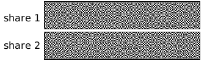

Visual cryptography
==========================

Basic Information
=================
Visual cryptography is a cryptographic technique which allows visual information (pictures, text, etc.) to be encrypted in such a way that the decrypted information appears as a visual image.

Every pixel from the secret image is encoded into multiple subpixels in each share image using a matrix to determine the color of the pixels. In the (2,N) case a white pixel in the secret image is encoded using a matrix from the following set, where each row gives the subpixel pattern for one of the components:

{all permutations of the columns of} : 

While a black pixel in the secret image is encoded using a matrix from the following set:
{all permutations of the columns of} : 

GitHub repository: https://github.com/JieJhih/visual-cryptography.git

Problem To Solve
================

- Python have several libraries to manipulate images, but is to slow when computing pixels of two images
- Offloading to C++ when computing pixels of two images

Perspective users
=================
1. People who want to send high security images 
2. Developer who want generate share 1 and share 2 images by CLI faster

System architecture
=================

-  Users will provide the image path to CLI
-  `Parser` will check the input whether it's validate, also convert the image to standard matrix format
-  `Processor` will computing the origin image to share 1 and share 2 image
- `Generator` overlapping share 1 and share 2 images
- Output `result.png` for validation

API decription
=================
- This project will provide a completed CLI frontend for user to provide image path
- Other program can call C++ API `Generate(const Matrix &mat)` to consume this service

Engineering infrastructure
=================
* Build tool
  * Make
* Testing tool
  * google test: testing C++ core components
  * pytest: testing the format reply from C++ API
* Version Control
  * Git
* Documentation
  * Plan to write comments for core components

Schedule
=================

- week 9 implement `Parser`
- week 10 implement `Processor`
- week 11 implement `Generator`
- week 12 implement C++ array to numpy array tansformer
- week 13 Complete unit testing
- week 14 Try to optimize the computing speed
- week 15 Prepare for oral presentation
- week 16 Present my project

References
=================
-  http://en.wikipedia.org/wiki/Visual_cryptography
