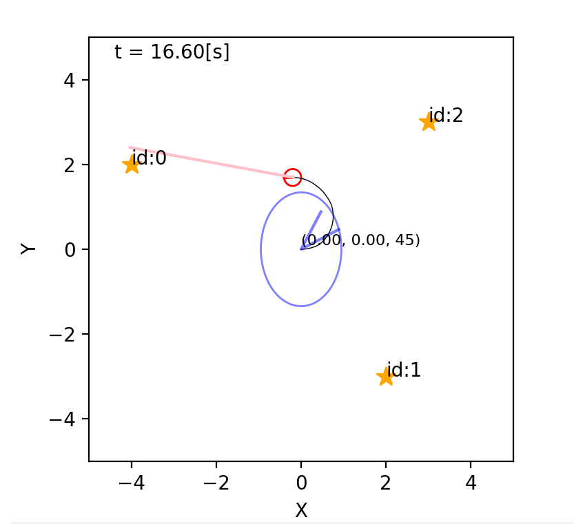
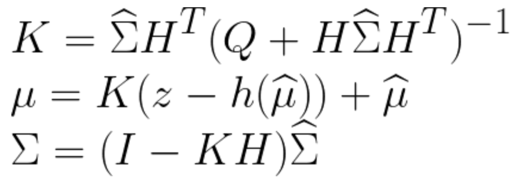
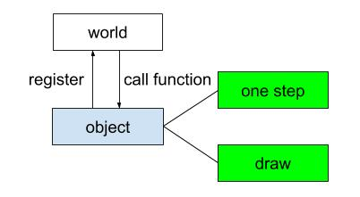

===========================
Proposal for Kalman filter 
===========================

Basic information
=================

`My project repository <https://github.com/jptom/study-probablistic-robotics/tree/main/nsd-term-project>`_

My base python code is from this book.
This author translated `Probabilistic Robotics <https://www.amazon.com/Probabilistic-Robotics-INTELLIGENT-ROBOTICS-AUTONOMOUS-ebook/dp/B00DJD9LXC>`_ in 2005.
This book introduce it's implementation in python by him in 2019.

.. image:: https://images-na.ssl-images-amazon.com/images/I/91C20m7ZgoL.jpg
   :scale: 20%
   
Problem to solve
================

Kalman filter is a technique of self-localazation of robotics.
It estimale mean and covarience of Gaussian distribution using observation of location of landmarks.
I am planning to implement whole the calculation as one function in c++.
   
Perspective users
=================

Beginner of probabilistic robotics

System architecture
===================

This is the simulator architecture.

Kalman filter is a part of "one step" function of robot object.
The World call "one step" function then all "one step" function of object who is 
registered in The World will be called.

API description
===============

Users need to write own robot program which has "one step" and "draw" function.
My package will support two popular self-localazation algorithm, one is Kalman filter.
I want the package can be use in not only simulator but also real robot.

   class Robot:
      def one_step{ 
         user code 
         filter.observation_update()
      }
     
      def draw{ user code }
     
   class Filter:
      def observation_update(observation){
         Implement in C++
      }

Engineering infrastructure
==========================

The package build with cmake. 

The testing use simulation.

The repository is hosted on GitHub and will use GitHub Action for continuous integration.

Schedule
========

- week 6: arrange note book (python)
- week 7: c++ 
- week*8:
- week 9: c++
- week10: c++
- week11: testing
- week12: GitHub Actionon
- week13: documentati
- week14:
- week15: prepare presentation

References
==========

-  `詳解 確率ロボティクス Pythonによる基礎アルゴリズムの実装 <https://www.amazon.co.jp/%E8%A9%B3%E8%A7%A3-%E7%A2%BA%E7%8E%87%E3%83%AD%E3%83%9C%E3%83%86%E3%82%A3%E3%82%AF%E3%82%B9-Python%E3%81%AB%E3%82%88%E3%82%8B%E5%9F%BA%E7%A4%8E%E3%82%A2%E3%83%AB%E3%82%B4%E3%83%AA%E3%82%BA%E3%83%A0%E3%81%AE%E5%AE%9F%E8%A3%85-KS%E7%90%86%E5%B7%A5%E5%AD%A6%E5%B0%82%E9%96%80%E6%9B%B8-%E4%B8%8A%E7%94%B0/dp/4065170060>`_
      materials 
      
      - https://github.com/ryuichiueda/LNPR_BOOK_CODES 
      - https://github.com/ryuichiueda/LNPR 
      - https://github.com/ryuichiueda/LNPR_SLIDES 
   
- https://github.com/AtsushiSakai/PythonRobotics

