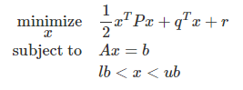

#################################################################
libqpsolver: a library for solving quadratic programming problems
#################################################################

Basic information
#################

* A numerical optimizer for solving quadratic cost functions with or without equality / inequality constraints

* The optimizer will be implemented in C. (Not C++ since author will like to integrate it into embedded devices later.)

* The future goal of this project is to integrate it in to embedded devices, which requires more improvments to
  speed up the code. I expect myself to finish the first version this semester and able to run it on normal PC.

GitHub: https://github.com/shengwen-tw/libqpsolver

Problem to solve
################

What is Quadratic Programming?
------------------------------

We call the variable x **optimization variables** to be minimized,

the first term **objective function** or **cost function**,

the second term **equality constraints**,

and the third term **inequality constraints**.

Why do we need Quadratic Programming?
-------------------------------------

Quadratic Programming shows up frequently in robotics field like control or trajectory planning.

* For example, if we want to map force and torque (6 degrees total) into motors numbers greater than 6,
then we have infinite combinations for choosing motor thrust.

* One of the solution is to choose the combination which has the lowest energy (in the sense of quadratic form)

There are two fantasic examples to illustate this problem:

.. image:: dragon.PNG

link: https://www.youtube.com/watch?v=uje6iUBbkwM

link: https://www.youtube.com/watch?v=sIi80LMLJSY&t=27s

Perspective users
#################

I will expect the user may have the following backgrounds:

1. Robotics

2. Control

Usually the problem set up will like: 

We want robots to do something, but there are multiple choices.
We then construct a quadratic cost function to analogize the energy cost and choose the least one strategy.

System architecture
###################

.. image:: architecture.PNG

API description
###############

we use **qp_t** datatype to store all informations that the solver need to solve the problem

To set up the optimization variables, we call:

``void qp_solve_set_optimization_variable(qp_t *qp, vector_t *x);``

To set up the objective function, we call:

``void qp_solve_set_cost_function(qp_t *qp, matrix_t *P, vector_t *q, vector_t *r);``

To set up the equality constraints, we call:

``void qp_solve_set_equality_constraints(qp_t *qp, matrix_t *A, matrix_t *b);``

To set up the upper bound of the inequality constraints, we call:

``void qp_solve_set_upper_bound_inequality_constraints(qp_t *qp, vector_t *ub);``

To set up the lower bound of the inequality constraints, we call:

``void qp_solve_set_lower_bound_inequality_constraints(qp_t *qp, vector_t *lb);``

To start solving the quadratic programming problem, we call:

``bool qp_solve_start(qp_t);``

Engineering infrastructure
##########################

Algorithms:
-----------

1. Linear algebra functions (Intel MKL): matrix arithmatics, linear system solver, matrix decompositions, etc.

2. Newton's method of optimization (an improved version of gradient descent algorithm)

``The gradient or Hessian matrix of newton's method actually vary with the sub-problems of the quadratic programming,
which means there will be several slightly different implementation of newton's method in the project.``

3. Phase1 method 

``The initial point of the optimization may not obay to the equality or inequality constraints of the problem.
In this case, it requires optimizer to solve for a feasilbe initial point before starting the optimization.``

4. Barrier method (limiting the searching space of optimization to obay the inequality constraints)

Software tools:
---------------

1. Pytest

2. GitHub Action

3. Octave/ MATLAB

``Though MATLAB may not be treated as a real programming language, it is still useful for me to do testing during the development.``

Schedule
########

W6 (10/19) ~ W7 (10/26)

* Write test program, wrapper functions for Intel MKL (finished)

* Implement no constraint solver. (closed form solution exists, directly solved) (finished)

* Implement equality constraints only solver. (closed form solution exists, directly solved) (finished)

* Implement inequality constraints only solver. (solve with gradient descent method) (finished)

W8 (11/2) ~ W9 (11/9)

* Implement inequality + equality constraints solver

W10 (11/16) ~ W11 (11/23)

* Implement phase1 method

W12 (11/30)

* Deploy GitHub Action for continuous integration

W13 (12/7) ~ W14 (12/14)

* Write unit test code (pytest)

W15 (12/21)

* presentation prepare

W16 (12/28) 

* presentation
