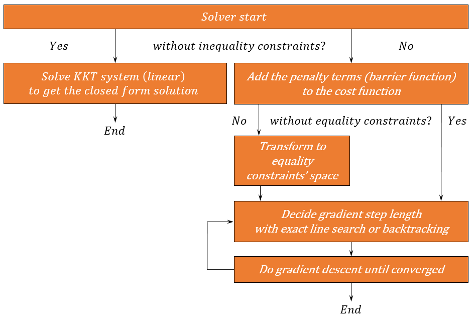

############################
Quadratic Programming Solver
############################

Basic information
#################

* A Numerical Optimizer For Quadratic Functions with or without equality/inequality constraints

* The optimizer will be implemented in C. (Not C++ since author will like to integrate it into embedded device later.)

* The future goal of this project is to integrate it in to embedded devices, which requires more optimizations to
  speed up the code. I will expect myself to finish the first version that can be ran on a normal personal computer
  for now.

GitHub link: https://github.com/shengwen-tw/qp-solver-c

Problem to solve
################

Designing a quadratic programming solver for computing resource restricted embedded system (cpu clock rate ~180Mhz)

**What is Quadratic Programming?**

.. image:: qp_formula.PNG

We call the variable x **optimization variables**,

the first term **objective function** or **cost function**,

the second term **equality constraints**,

and the third term **inequality constraints**.

**Why do we need Quadratic Programming?**

Quadratic Programming shows up frequently in robotics like control or trajectory planning.

* For example, we may want to map force / torque (6 degree total) to motors number that are greater than 6,
then we are facing to have infinite choice of motor thrust.

* To solve the problem, we can choose the one combination which hs the lowest energy (in the sense of quadratic function)

There are two fantasic examples to illustate this problem:

link: https://www.youtube.com/watch?v=uje6iUBbkwM

.. image:: omnicopter.PNG

link: https://www.youtube.com/watch?v=sIi80LMLJSY&t=27s

Perspective users
#################

I will expect the user may have the following backgrounds:

1. Robotics engineers

2. Control engineerss

Usually the problem set up will like: We want to make robots to do something, but there are multiple choices to go,
so we construct a quadratic cost function to analogize the energy and find the least energy costing strategy.

System architecture
###################

API description
###############

we use **qp_t** datatype to store all informations that the solver need to solve the problem

To set up the optimization variables, we call:

``void qp_solve_set_optimization_variable(qp_t *qp, vector_t *x);``

To set up the objective function, we call:

``void qp_solve_set_cost_function(qp_t *qp, matrix_t *P, vector_t *q, vector_t *r);``

To set up the equality constraints, we call:

``void qp_solve_set_equality_constraints(qp_t *qp, matrix_t *A, matrix_t *b);``

To set up the upper bound of the inequality constraints, we call:

``void qp_solve_set_upper_bound_inequality_constraints(qp_t *qp, vector *ub);``

To set up the lower bound of the inequality constraints, we call:

``void qp_solve_set_lower_bound_inequality_constraints(qp_t *qp, vector *lb);``

To start solving the quadratic programming problem, we call:

bool qp_solve_start(qp_t);

Engineering infrastructure
##########################

Algorithms I need:

1. Linear System Solver (Intel MKL at lower level)

2. Gradient descent algorithm (easy method for solving cost minimization problem)

3. Newton's method of optimization (Improved version of gradient descent algorithm)

4. Exact line search algorithm (Deciding the step length for gradient descent)

5. Backtrack line search algorithm (Deciding the step length for gradient descent)

6. Barrier method (limit the searching space of optimization with inequality constraints)

Schedule
########

W6 (10/19) test program for Intel MKL

W7 (10/26) implement qp solver with no constraints

W8 (11/2) implement qp solver with equality constraints only

W9 (11/9) continue of last week

W10 (11/16) implement gradient descent method

W11 (11/23) implement newton's of optimization

W12 (11/30) continue of last week

W13 (12/7) implement log barrier function

W14 (12/14) implement log barrier function

W15 (12/21) implement qp solver with inequilty constraints

W16 (12/28) final presentation
