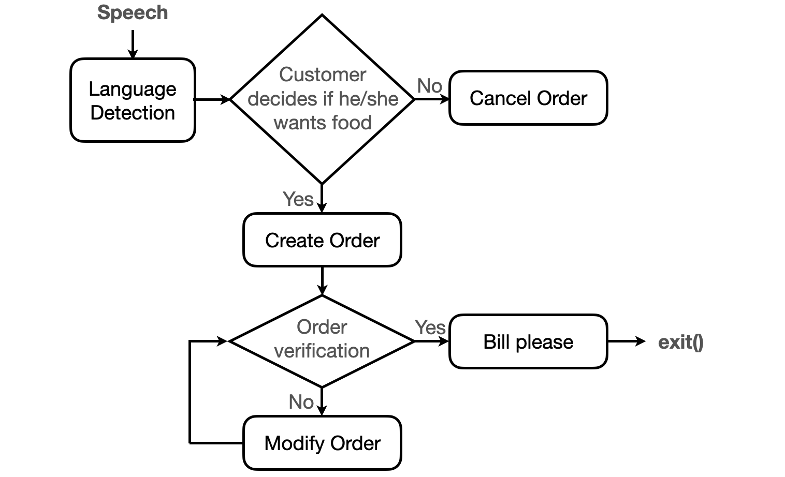

=================
Taking Your Order
=================

Basic information
=================

This is an automatically process to a virtual assistant that can take and process orders.

You can use the following command to checkout from repository:
``git clone https://github.com/yenchanglu/takingYourOrder``

Problem to solve
================

It often feels like everything in our lives is designed to make the world move faster. An example of this modern impatience is the drive-thru: people became frustrated with waiting in slow drive-thru line. Why "fast food" restaurant speed of customer order processing is getting slow? Because it is still being done today as they were 50 years ago. This project is working on a way for modernizing the drive-thru, reducing unnecessary procedures and waiting time. It can also free up restaurant staff to focus on tasks that increase throughput. What's even better is that ordering food in a foreign language can be no longer frightening since the system will also translate the food and beverage menu in many different languages.

Perspective users
=================

Clerk doesn't need to enter orders into POS and announce the total, receive payment and give change to customer anymore. Clerk just receives order and gives order to customer with this system. For hungry and thirsty people, it will make waiting in line less-annoying. It will also make travel easier for the foreign tourists.

System architecture
===================

API description
===============

``get_language()`` return language; used to determine an appropriate language

``int process_order(language)`` return 0: success, return others: failure; used to create an order list and start ordering process

``int verify_order(index)`` return 0: success, return others: failure and call the function modify_order(index); used to verify the order list is correct or not

``modify_order(index)``, used to modify the order list

``bill_please(index)``, used to announce the total

``cancel_order()``, used to cancel the ordering process and exit()

Engineering infrastructure
==========================

The system uses C++ and Python for speech recognition and high-level API, and will be built with cmake. This GitHub repository will be setting up continuous integration with GitHub Actions.

Coding style
__________________

* .clang-format - Config file for clang-format. clang-format is a tool to  formatting C/C++ code
* .style.yapf - Config file for yapf, formatter for Python code.

Testing framework
__________________

* C++ unit testing with Google Test
* Unit testing Python code with the unittest module

Schedule
========

* W1 (10/19): Planning, software architecture and development
* W2 (10/26): Studying on speech recognition algorithms
* W3 (11/2): Implementing the third-party speech recognition module
* W4 (11/9): Developing the ordering system
* W5 (11/16): Improving the performance and user experience
* W6 (11/23): Integrating voice orders into the system 
* W7 (11/30): Writing unit tests for C++/Python
* W8 (12/7): Preparing for final presentation and improving system
* W9 (12/14): Software testing
* W10 (12/21): Debugging and optimization
* W11 (12/28): Term project presentation

References
==========

1. https://github.com/mozilla/DeepSpeech

2. https://creately.com/diagram/example/ikqbnbgp1/McDonalds%20Drive%20Through%20Ordering%20Process
